# Spring Boot + Angular e-Commerce Project REST API

- Java 17
- Spring Boot
- PostgreSQL
- Angular 15.2.0 (install npm)
- Bootstrap
- Spring Security
- JWT Authentication
- Multiple Role-Based Authentication
- In this section describe very short description about this project

- Admin: email: mradmin@example.com, password: mradmin@example.com
- User: email: mruser@example.com, password: mruser@example.com
### Home Page 

Users will see all product lists and can search by product
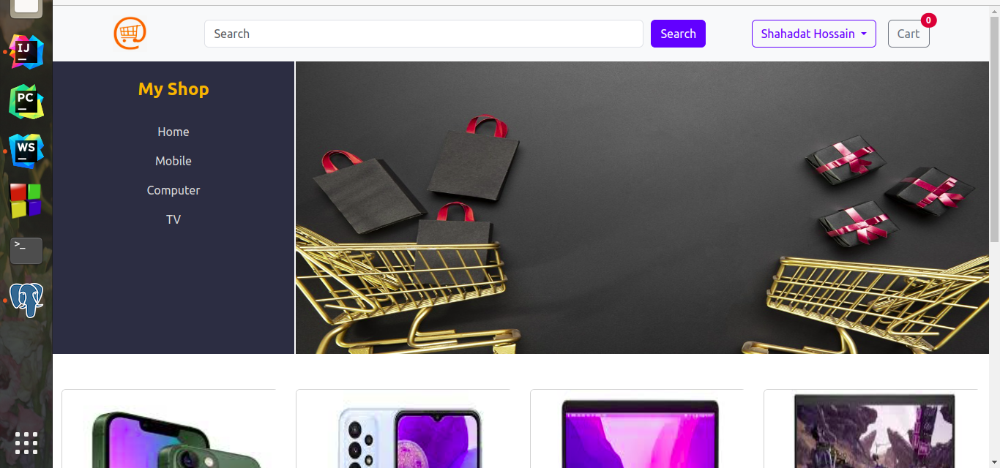

### Pagination
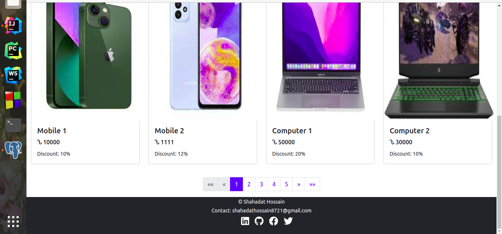

### Product details and user can be added to the cart
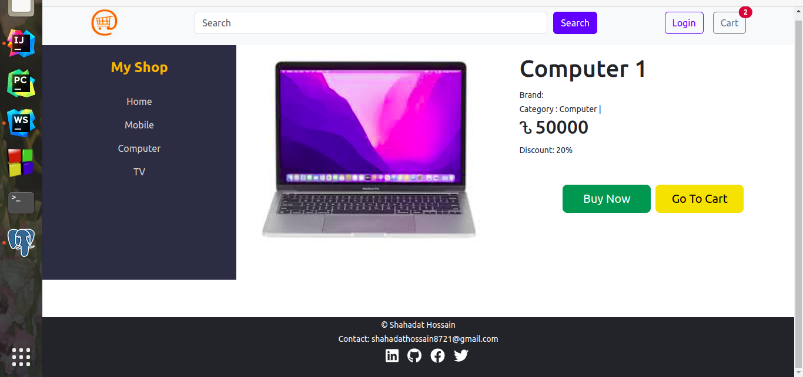

### Cart Items list and calculate price and product quantity

cart Items list page calculates price, product quantity, and also items stored in local storage before order.
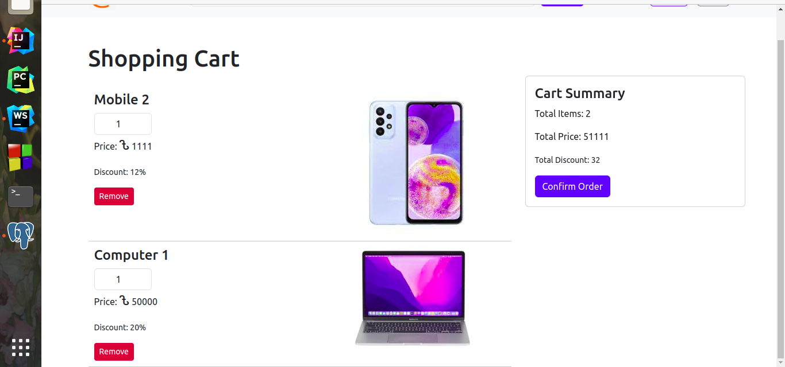

### Login Form
When the user clicks the confirm order button then needs to login, if user login then go to the address for shipping.
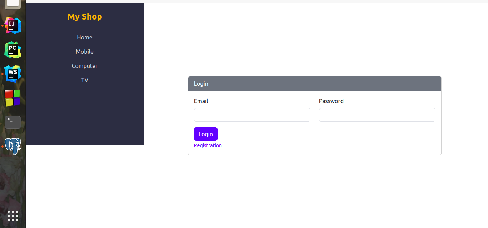

### Registration Form
Registration new form with form validation
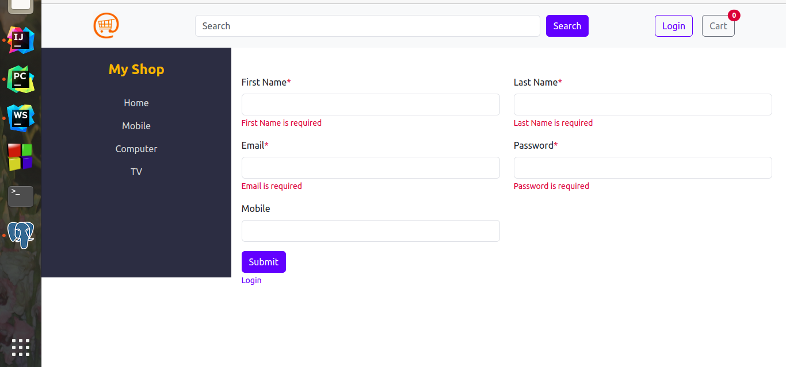

### Send Verify Link on Email
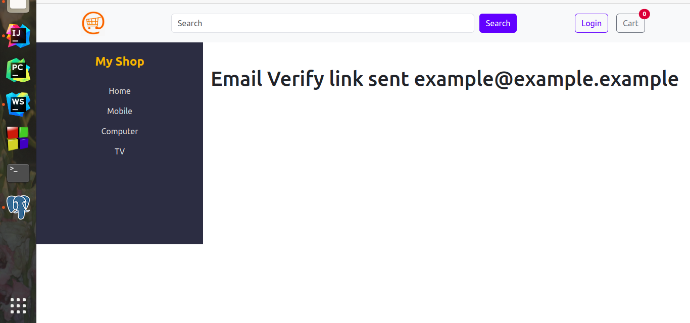

### Verification Link
Click on the verification link the email will be verified successfully.
 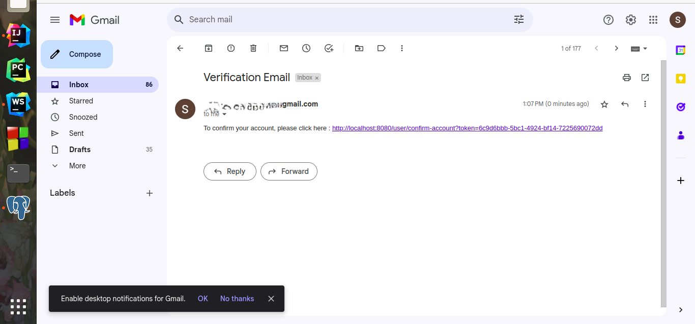
 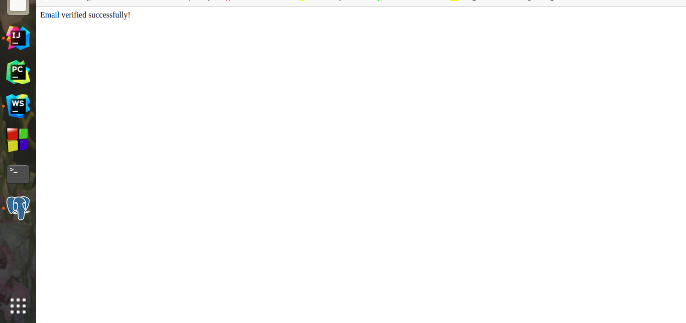
 
### User order details
user will see his new order status(pending order) and order history
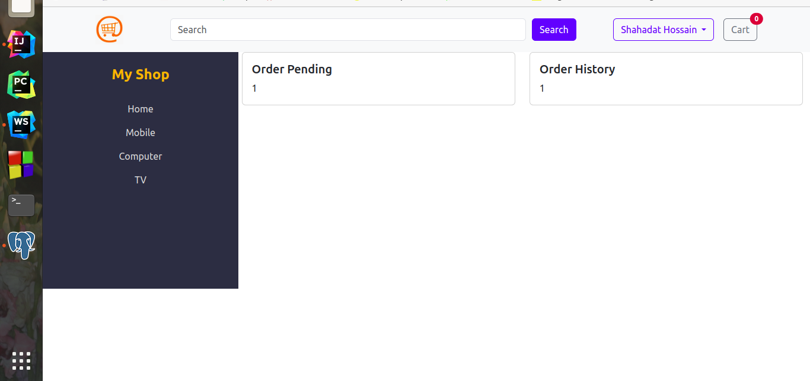

### Admin Dashboard
Admin dashboard admin can access everything and also see the order pending status and order delivery status
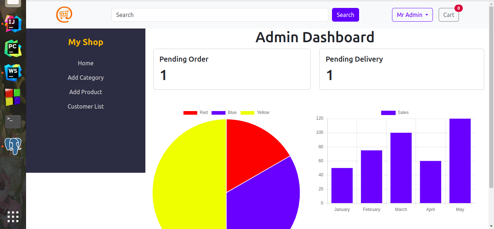

### Admin Pending Order Confirm
Pending Order admin can be confirm or delete
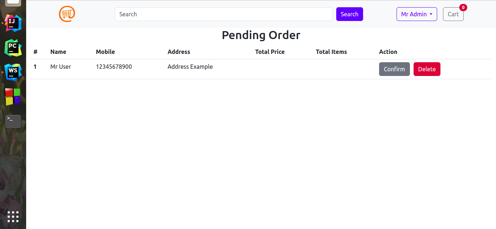

### Admin add new product
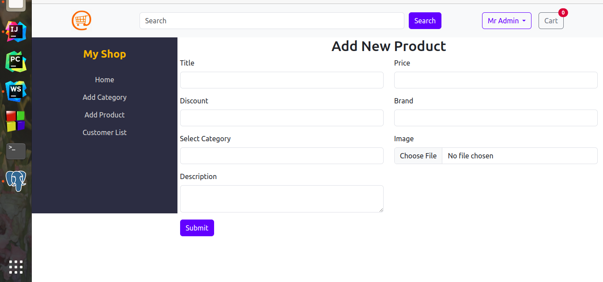

### Admin Product Edits
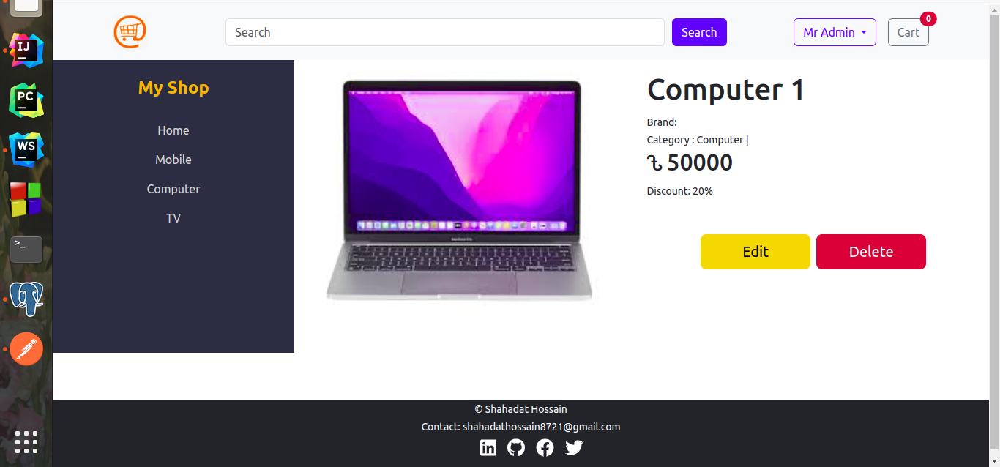
